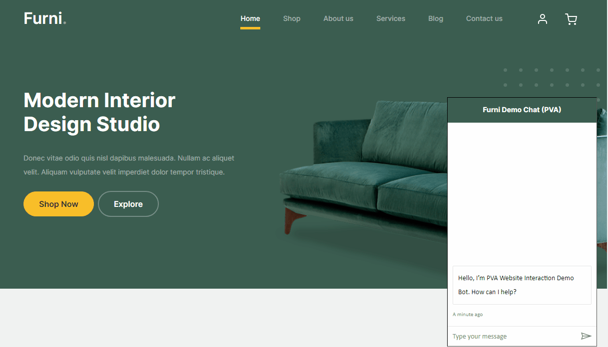

# PVA Website Interaction

An example website that demonstrates how to create a deeply interactive website experience from Microsoft Power Virtual Agents.  Shows how you can capture events sent from Microsoft Power Virtual Agents and use that information to interact with elements on a website.


## Demo



You can view an interactive demo [here](https://static.functionprologue.com/Examples/PVA/WebsiteControl/)


## Run Locally

Clone the project

```bash
  git clone https://github.com/KevinVoell/PVAWebsiteInteraction
```

Go to the project directory

```bash
  cd PVAWebsiteInteraction
```

Open the ./js/PVAInteraction.js file and find the line

```javascript
var botEndpoint = "https://LINK TO YOUR PVA APP";
```

and update it to be the token endpoint for your PVA Bot.

Open the index.html file in your browser


## Usage/Examples

In the Microsoft Power Virtual Agents bot ask any of the following questions:
- How do I login?
- What are your customers saying?
- Tell me about the Kruzo Aero Chair
- How do I shop?
- What chairs do you have?

## Code

The magic happens in the ./js/PVAInteraction.js file.

```javascript
window.onload = function() {
    var botEndpoint = "https://LINK TO YOUR PVA APP";

    const store = window.WebChat.createStore({},
        ({ dispatch }) => next => action => {
            if (action.type === "DIRECT_LINE/CONNECT_FULFILLED") {
                var dispatchJSON = {
                    meta: {
                        method: "keyboard",
                    },
                    payload: {
                        activity: {
                            channelData: {
                                postBack: true,
                            },
                            name: 'startConversation',
                            type: "event",
                        },
                    },
                    type: "DIRECT_LINE/POST_ACTIVITY",
                }
                dispatch(dispatchJSON);
            } else if (action.type === "DIRECT_LINE/INCOMING_ACTIVITY" && action.payload?.activity?.type === "event") {
                switch(action.payload?.activity?.name)
                {
                    case 'ShowElement':
                        highlightElement(action.payload?.activity?.value);
                        break;

                    case 'AddCart':
                        addCart(action.payload?.activity?.value);
                        break;
                }
            }
            return next(action);
        }
    );

    fetch(botEndpoint)
        .then(response => response.json())
        .then(conversationInfo => {
            window.WebChat.renderWebChat({
                    directLine: window.WebChat.createDirectLine({
                        token: conversationInfo.token,
                    }),
                    store: store,
                    styleOptions: styleOptions = {
                        hideUploadButton: true
                    }
                },
                document.getElementById('webchat')
            );
        })
        .catch(err => console.error("An error occurred: " + err));
}
```

## Acknowledgements

 - [Furni Website Template](https://themewagon.github.io/furni/)
 - [driver.js](https://driverjs.com)
